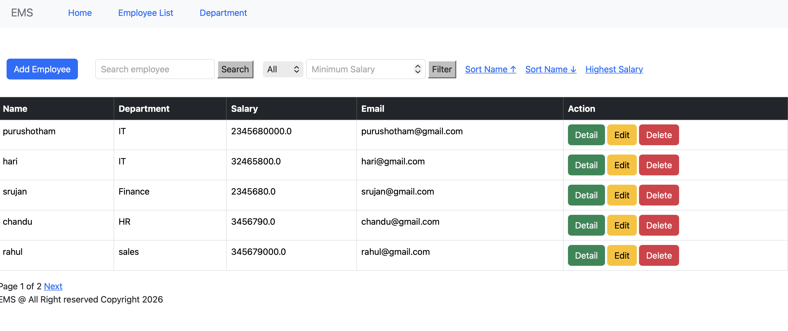

# 🚀 Flask Development

A comprehensive Flask learning repository that takes you from Flask fundamentals to building production-ready web applications. This repository covers everything from routing, Jinja2 templates, SQLAlchemy ORM, Authentication, and REST APIs to **Basic & Advanced CRUD Operations** including **Searching, Filtering, Sorting, and Pagination**.

Whether you're a beginner learning Flask or a developer looking to strengthen your backend development skills, this project provides practical examples and real-world implementations using industry best practices.

---

## Features

- Flask Fundamentals
- Routing & URL Parameters
- Jinja2 Templates & Template Inheritance
- Static Files
- Flask Blueprints
- SQLAlchemy ORM
- Error Handling
- REST API Basics
- Flask CLI

## CRUD Operations

- Create Records
- Read Records
- Update Records
- Delete Records

## Advanced CRUD Operations

- Search Records
- Dynamic Filtering
- Sort Records (Ascending & Descending)
- Pagination
- Combined Search + Filter + Sort + Pagination
- Optimized SQLAlchemy Queries
- Secure Database Transactions

---





## Project Structure

```text
Flask-Development/
│
├── app/
│   ├── models/
│   ├── routes/
│   ├── templates/
│   ├── static/
│   ├── forms/
│   ├── utils/
│   └── __init__.py
│
├── uploads/
├── config.py
├── requirements.txt
├── run.py
└── README.md
```

---

## Prerequisites

- Python 3.11+
- Git
- VS Code (Recommended)

Check Python version

```bash
python --version
```

or

```bash
python3 --version
```

---

## Clone Repository

```bash
git clone https://github.com/jvpurushotham/Flask-Development.git
```

Move inside the project

```bash
cd Flask-Development
```

---

## Create Virtual Environment

## Windows

```bash
python -m venv venv
```

Activate

### Command Prompt

```cmd
venv\Scripts\activate
```

### PowerShell

```powershell
venv\Scripts\Activate.ps1
```

---

## Linux / macOS

```bash
python3 -m venv venv
```

Activate

```bash
source venv/bin/activate
```

---

## Install Dependencies

Upgrade pip

```bash
python -m pip install --upgrade pip
```

Install required packages

```bash
pip install -r requirements.txt
```

---

## Run the Flask Application

```bash
python run.py
```

or

```bash
flask run
```

Application will start at

```text
http://127.0.0.1:5000
```

---

## Database Setup

If using Flask SQLAlchemy

```python
from app.models import db

db.create_all()
```

Or using Flask Shell

```bash
flask shell
```

```python
from app.models import db

db.create_all()
```


## 🤝 Contributing

Contributions are welcome!

1. Fork the repository

2. Create a new branch

```bash
git checkout -b feature-name
```

3. Commit your changes

```bash
git commit -m "Added new feature"
```

4. Push your branch

```bash
git push origin feature-name
```

5. Open a Pull Request

---

## Support

If this repository helped you learn Flask, please consider giving it a ⭐ on GitHub.

---

## 👨‍💻 Author

** J V Purushotham **

GitHub: https://github.com/jvpurushotham

---

## Happy Coding! 